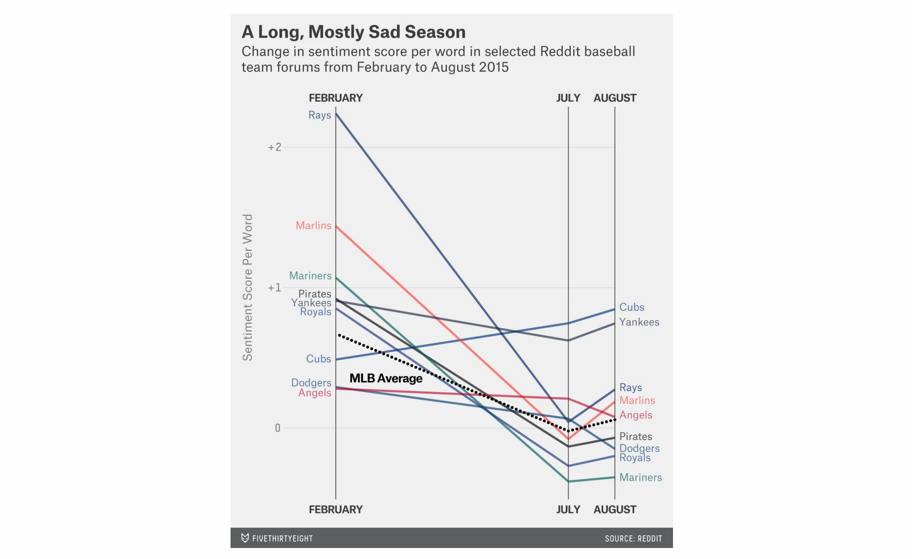
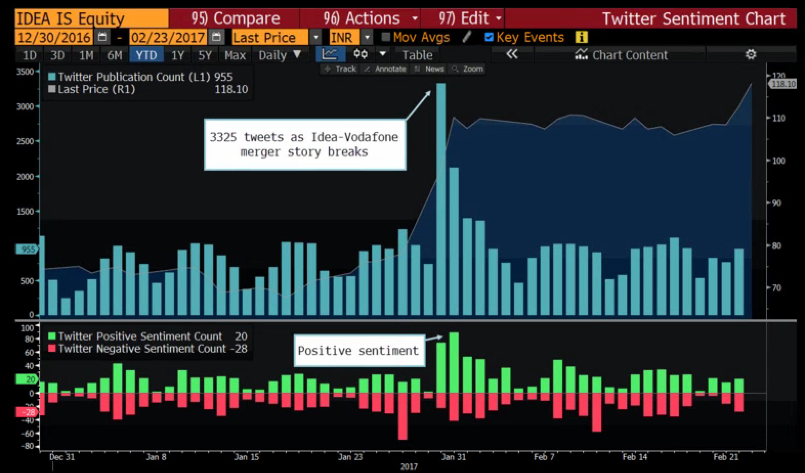
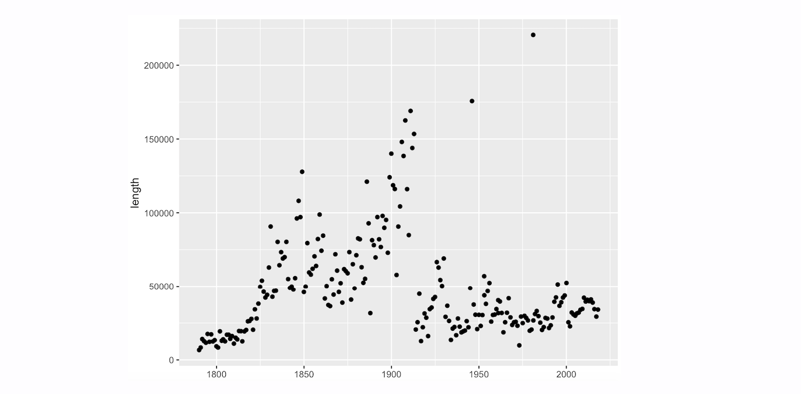
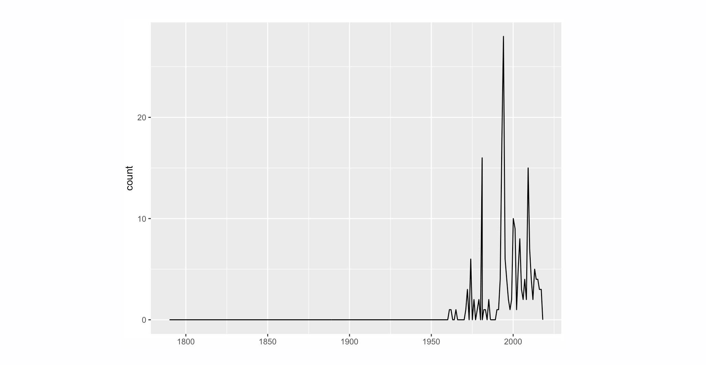
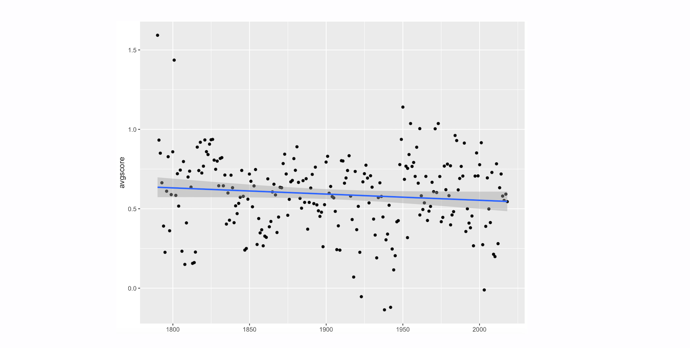

# Text Mining and Sentiment Analysis in R
Instructor: [Aleszu Bajak](http://aleszu.com/)

# Introduction

This O'Reilly course will introduce participants to the techniques and applications of **text mining and sentiment analysis** by training them in easy-to-use open-source tools and scalable, replicable methodologies that will make them stronger data scientists and more thoughtful communicators. 

Using **RStudio** and several engaging and topical datasets sourced from **politics, social science, and social media**, this course will introduce **techniques for collecting, wrangling, mining and analyzing text data**. 

The course will also have participants derive and communicate insights based on their textual analysis using a set of data visualization methods. The techniques that will be used include n-gram analysis, sentiment analysis, and parts-of-speech analysis.

By the end of this live, hands-on, online course, you’ll understand:

- The techniques and applications of textual analysis
- How to convert unstructured text from politics, social science, and social media into data 
- Techniques like **n-gram analysis**, **sentiment analysis** and **parts-of-speech analysis**

And you’ll be able to:

- Ingest various text formats into RStudio
- Wrangle and analyze that text
- Visualize and communicate insights about those textual data


# Requirements and accessing data

Ideally, participants will have the **latest versions of R and RStudio** and the **tidytext** and **tidyverse**. To access all R scripts, participants should next download [this Github repository](https://github.com/aleszu/text-mining-course) and set it as their working directory in RStudio using setwd(). 

This course can also be accessed on **RStudio Cloud** [here](https://rstudio.cloud/project/434664).


# Table of contents

1. [Course outline](#course-outline)
2. [Datasets used](#datasets-used)
2. [Text analysis in the wild](#text-analysis-in-the-wild)
3. [Text analysis methods](#text-analysis-methods)
4. [Sentiment analysis methods](#sentiment-analysis-methods)
5. [Visualization and communication](#visualization-and-communication)


# Course outline

- We'll first explore several real-world applications of data mining and sentiment analysis. 
- Next, we'll walk through several techniques using R. 
- Finally, we'll explore techniques to visualize and communicate insights about those textual data.


# Datasets used

- [Trump's 2018 State of the Union speeches](https://github.com/aleszu/text-mining-course/blob/master/trump2018.txt) 
- [U.S. State of the Union speeches](https://github.com/aleszu/text-mining-course/blob/master/sou.csv)
- [Trump tweets from July 2019](https://github.com/aleszu/text-mining-course/blob/master/Trump_tweets.csv)
- [Wine reviews from WineEnthusiast.com](https://github.com/aleszu/text-mining-course/blob/master/wine-reviews.zip)
- [Tweets by U.S. Senate candidates through 2018](https://github.com/aleszu/text-mining-course/blob/master/alltweets.zip)


# Text as data 

Text mining is all about making sense of text. That could mean counting the frequency of specific words, understanding the overall sentiment of a document, or applying statistical techniques to draw big-picture conclusions from a corpus. Whether one is analyzing social media posts, customer reviews or news articles, these techniques can be essential to understanding and deriving meaningful insights. 

Note: Though there are several ways to mine data and perform sentiment analysis in R -- with packages such as [tm](https://cran.r-project.org/web/packages/tm/), [quanteda](https://cran.r-project.org/web/packages/quanteda/), [udpipe](https://cran.r-project.org/web/packages/udpipe/index.html), and [sentimentr](https://cran.r-project.org/web/packages/sentimentr/index.html) -- this course uses R's [tidytext](http://tidytextmining.com/) package, developed by Julia Silge and David Robinson, and several tidy tools found in the [tidyverse](https://cran.r-project.org/web/packages/tidyverse/index.html) package.


# Text analysis in the wild

BuzzFeed's [analysis of U.S. State of the Union speeches](https://www.buzzfeednews.com/article/peteraldhous/trump-state-of-the-union-words) over time is a great example of text analysis. As an added bonus, journalist Peter Aldhous shared all his data and open-sourced his methodology as an [Rmarkdown document](https://buzzfeednews.github.io/2018-01-trump-state-of-the-union/).   


The New York Times' [Mueller Report citations article](https://www.nytimes.com/interactive/2019/04/19/us/politics/mueller-report-citations.html) is another example of a text analysis in mainstream media, used to explain which of and how often Trump's associates appeared in the report. Check out my [Storybench tutorial that includes R code](http://www.storybench.org/how-to-build-a-bubble-chart-of-individuals-mentioned-in-the-mueller-report/) for mining the Mueller Report for specific keywords.  


FiveThirtyEight published an [analysis tallying](https://fivethirtyeight.com/features/which-democrats-are-campaigning-on-trump/) the instances of the name "Trump" in 2020 candidate messaging. The dataset was 2020 candidate emails sent to subscribers. 


The Boston Globe's [Arresting Words investigation](https://apps.bostonglobe.com/graphics/2016/04/arresting-words/) visualized transcripts of police arrests to isolate tops words uttered by those being hauled in. 


## Text analysis in marketing 

Crimson Hexagon, recently acquired by Brandwatch, delivers "actionable social insights for the enterprise," i.e. how is Under Armour clothing or 5-hour Energy Drink [being discussed online](https://www.slideshare.net/liberateyourbrand/crimson-hexagon-10-2030)? 


## Sentiment analysis in the wild

FiveThirtyEight [applied sentiment analysis](https://fivethirtyeight.com/features/the-happiest-and-saddest-fans-in-baseball-according-to-reddit/) to Reddit comments to assess the overall "sadness" of baseball fans summarized by team. 



In Roll Call, I [published a sentiment analysis](https://www.rollcall.com/news/campaigns/lead-midterms-twitter-republicans-went-high-democrats-went-low) of tweets by politicians in the run-up to the 2018 Midterms. We'll get into this data and analysis later in this course.  


FiveThirtyEight used sentiment analysis to help [contrast presidential inauguration speeches](https://fivethirtyeight.com/live-blog/donald-trump-inauguration/). Does the "More positive words" annotation and x-axis ticks make this graphic easier to understand?


## Sentiment analysis in finance

Bloomberg routinely analyzes Twitter sentiment surrounding keywords, companies and entities, [such as this 2017 Vodaphone analysis](https://www.bloomberg.com/professional/blog/twitter-trade-profits-vodafone-courts-idea-cellular-india/), to better inform the trading strategies of its clients.





J.P. Morgan [has published about sentiment analysis](https://www.jpmorgan.com/global/research/machine-learning) it has applied to analyst reports and news articles to assess the relationship between stock trades and news sentiment.


## Text mining for fun

The community of tidytext users is large and very open to sharing code. Here are some examples of informal text mining and sentiment analyses that have been popoular on the Internet: [craft beer reviews](https://www.kaylinpavlik.com/tidy-text-beer/) and [Harry Potter books](https://cfss.uchicago.edu/notes/harry-potter-exercise/).


## Discussion

**Question 1:** What real-world text analysis projects stuck out to you as memorable? Why? What was harder to get your head around and why? 

**Question 2:** Choose one of the projects and write out some potential caveats, assumptions and/or problems faced with data collection, analysis or communication. Share via the group chat. 


# Text analysis methods

This section will introduce methods for tokenization, n-gram analysis and part-of-speech analysis. We will then conduct a brief text analysis activity to isolate top words, top phrases and top parts of speech for a dataset. 


## Tokenization

First let's do some basic text ingestion and analysis using tidytext functions like unnest_tokens() for tokenizing and count() for, well, counting. 

```{r}
# Load packages
library(tidyverse)
library(tidytext)

# Text and tokenization
line <- c("The quick brown fox jumps over the lazy dog.") 
line 

line_tbl <- as_tibble(line) # get into Tidy format
line_tbl

line_tokenized <- line_tbl %>%
  unnest_tokens(word, value)  # tokenize!
line_tokenized

line_tokenized %>% count(word) # count
line_tokenized %>% count(word, sort=TRUE) # count and sort
```

Let's also remove the stop words using the anti_join() function, [which is well explained here](https://rpubs.com/williamsurles/293454). As the slide shows, anti_join() removes everything that matches a specified column in a supplied table. We'll use left_join() later in this course. SQL and Python users will know this as a merge function.


We can always inspect this with glimpse(). 

```{r}
line_clean <- line_tokenized %>% 
  anti_join(stop_words) # cut out stopwords 
line_clean 

glimpse(stop_words) # let's inspect stopwords. 
```

**Question**: Are all of these stop words really worth cutting out? Can you find one that you want to include in your analysis?


## n-gram analysis

Google's [n-gram viewer](https://books.google.com/ngrams/) is probably the most well-known example of n-gram analysis. We'll use President Donald Trump's 2018 State of the Union speech to explore 1-grams, 2-grams and 3-grams. 

First, we'll ingest the text file, tidy the data and then tokenize the text. 

```{r}
trump_speech <- read_file("trump2018.txt") # alternatively, use read_file(file.choose())
trump_speech

trump_speech_tbl <- as_tibble(trump_speech) # tidy the data
trump_speech_tbl

trump_counts <- trump_speech_tbl %>%
  unnest_tokens(word, value) # tokenize
trump_counts # 5,864 words
```

We'll next use the count() function we previously introduced.  Wow, that's a lot of *and's, the's* and *to's*. Let's remove the stop words and count the words. 

```{r}
trump_counts <- trump_speech_tbl %>% 
  unnest_tokens(word, value) %>%
  count(word, sort = TRUE) %>% # count words
  glimpse()

trump_counts <- trump_speech_tbl %>%
  unnest_tokens(word, value) %>%
  anti_join(stop_words) %>% # remove stopwords
  count(word, sort=TRUE) %>%
  glimpse()

head(trump_counts)
head(trump_counts, n=15)
#write.csv(trump_counts, "trump_counts.csv") # write to csv
```

Ok, moving on to bigrams. Let's use unnest_token()'s "token" and "n" arguments. Then we'll count the bigrams and view them with head(). 

```{r}
# Bigrams
bigrams <- trump_speech_tbl %>%
  unnest_tokens(bigram, value, token = "ngrams", n = 2) %>%
  count(bigram, sort=TRUE)
head(bigrams, n=20) # too many stopwords!
```

This works but it's not terribly insightful because of all the stop words. Let's remove stop words according to the way Julia Silge and David Robinson suggest in [Text Mining with R](https://www.tidytextmining.com/ngrams.html). 

```{r}
# Better bigrams
trump_bigrams <- trump_speech_tbl %>%
  unnest_tokens(bigram, value, token = "ngrams", n = 2) 

bigrams_separated <- trump_bigrams %>%
  separate(bigram, c("word1", "word2"), sep = " ") # separate bigram by space

bigrams_filtered <- bigrams_separated %>% 
  filter(!word1 %in% stop_words$word) %>% # filter out stopwords from word1 column
  filter(!word2 %in% stop_words$word) # filter out stopwords from word2 column

bigram_counts <- bigrams_filtered %>% 
  count(word1, word2, sort = TRUE) # count new bigrams

bigram_counts 
```

Now we see some interesting bigrams like "MS 13," "North Korea" and "immigration system." 

**Question:** How would you export this table as a CSV? Can you write the function in R? 

Finally, let's change the "n" argument to "3" and count the trigrams.

```{r}
# Trigrams
trump_trigrams <- trump_speech_tbl %>%
  unnest_tokens(trigram, value, token = "ngrams", n = 3) 

trigrams_separated <- trump_trigrams %>%
  separate(trigram, c("word1", "word2", "word3"), sep = " ") # separate bigram by space

trigrams_filtered <- trigrams_separated %>% 
  filter(!word1 %in% stop_words$word) %>% # filter out stopwords from word1 column
  filter(!word2 %in% stop_words$word) %>% # filter out stopwords from word2 column
  filter(!word3 %in% stop_words$word) # filter out stopwords from word3 column

trigram_counts <- trigrams_filtered %>% 
  count(word1, word2, word3, sort = TRUE) # count new bigrams

trigram_counts 
```

**Question 1:** How would you summarize these results for a non-technical audience? Could you design a top 10 table with your exported CSV and embed it alongside your code? 

**Question 2:** What would your headline be for this 2018 State of the Union speech, based on these n-grams, bigrams and/or trigrams?  


## Doing string calculations

The stringr package brings together loads of useful tools for string manipulation and calculation. Below, run through the code to see how str_length() can be used to calculate the length of strings. 

```{r}
# Calculate length of strings 
line <- c("The quick brown fox jumps over the lazy dog.") 
line 

library(stringr)
str_length(line) 
```

Next, we'll pull in the State of the Union speeches CSV file and create a new object with a new column "length." In this new column, we'll store the length of each speech we calculate with str_length().  Using the ggplot2 package we can plot a scatterplot of date vs. length to visualize the length of the speeches over time.  

```{r}
sou <- read_csv("sou.csv")
glimpse(sou)

length_of_sous <- sou %>%
  mutate(length = str_length(text))
glimpse(length_of_sous)

# Plot it 
ggplot(length_of_sous, aes(date, length)) +
  geom_point()
```



We can also create something akin to the Google n-gram viewer by "searching" through the speeches using "str_count" and calculating the number of times a specific keyword or phrase appears. We can then plot the output as a line chart. 

```{r}
# Search for a string with "str_detect"
speeches_w_keyword <- sou %>%
  group_by(text, date, president, message) %>%
  mutate(count = str_count(text, "health care")) # try "people" or "crime" 
speeches_w_keyword

# Plot it
ggplot(speeches_w_keyword, aes(date,count)) +
  geom_line(stat="identity")
```




## Q&A
**Question 1:** Take a look at this helpful stringr cheat sheet [here](https://github.com/rstudio/cheatsheets/raw/master/strings.pdf) or below. What other string-based questions might you want to ask this dataset? 

**Question 2:** Based on the n-gram analysis and string-based calculations we've performed, what other questions could you come up with for the State of the Union speeches or what other dataset might you want to compile for one of the methodologies practices above?


# Sentiment analysis methods

Sentiment analysis is being widely applied to understand politics, finance or sports, as we saw from our examples analyzing the sentiment of social media from candidates running for Senate, news articles about a particular company or product, and Reddit comments from baseball fans. 

While sentiment analysis can involve complex natural language processing models like [word2vec](https://skymind.ai/wiki/word2vec), for the purposes of this course we'll explore its simplest form: scoring individual words based on a dictionary of word/score pairs. Let's look at some sentiment dictionaries.

```{r}
# Sentiment dictionaries
afinn <- get_sentiments("afinn")
afinn 

bing <- get_sentiments("bing")
bing

nrc <- get_sentiments("nrc")
nrc

labMT<- read.csv("labMT.csv")
labMT
```

Let's score the sentiment of a very simple sentence using the [afinn dictionary](https://arxiv.org/abs/1103.2903). We'll ingest the sentence, tidy it, tokenize it and then use inner_join() to merge in the afinn word/score dictionary and leave only those words that have been scored. Finally, we'll calculate the average score of the five words that were scored. (Notice that we started out with 10 words.)

```{r}
alexander <- c("Alexander and the terrible, horrible, no good, very bad day")
alexander <- as.tibble(alexander) 

alexander_scored <- alexander %>%
  unnest_tokens(word, value) %>%
  inner_join(afinn, by="word") %>% 
  glimpse()

mean(alexander_scored$score)
```

Ok, let's go to a bigger dataset: the State of the Union speeches. Let's merge in the afinn dictionary and then create a pivot table that summarizes the average sentiment score by president. Finally, we'll plot the results as a bar chart. 

```{r}
sentiment_sou <- sou %>%
  unnest_tokens(word, text) %>%
  inner_join(afinn, by = "word") # we'll join in the AFINN dictionary
glimpse(sentiment_sou)

sentiment_by_president <- sentiment_sou %>%
  group_by(president) %>% 
  summarise(avgscore = mean(score)) %>%
  arrange(desc(avgscore)) %>%
  glimpse()

ggplot(sentiment_by_president, aes(reorder(president, avgscore), avgscore)) +
  geom_col() +
  coord_flip()
```


**Question 1:** Do you have any idea why a particular president is in a particular spot? Why might FDR, for example, be near the bottom? 

**Question 2:** How would you label the x-axis? What's going to be most clear and who is your intended audience?

Let's now look at the sentiment of State of the Union speeches over time. Instead of organizing by president, we can group_by() message and date. Plotting that as a scatterplot and fitting a linear regression to the data, we see that the speeches appear to be relatively stable, in terms of sentiment, across time.

```{r}
sentiment_sou_afinn <- sentiment_sou %>%
  group_by(message, date) %>% # We "group by" message and date instead of by president
  summarise(avgscore = mean(score)) %>%
  glimpse()

ggplot(sentiment_sou_afinn, aes(date, avgscore)) +
  geom_point() + 
  geom_smooth(method="lm")
```




**Question:** What other insights might you want to communicate alongside this chart? 


## Activity 

You have the "labMT" dictionary. Swap it in for "afinn" in the inner_join() function and try to recreate the scatterplot with the labMT-scored speeches. 

**Question:** What difference do you notice when the speeches are scored with the labMT dictionary?  


## Applying sentiment analysis to social media

Now, let's recreate the sentiment analysis my graduate student Floris Wu and I performed for [Roll Call on Senate candidate tweets](https://www.rollcall.com/news/campaigns/lead-midterms-twitter-republicans-went-high-democrats-went-low) in the lead-up to the 2018 midterms. 


First, let's pull in the tweets, which were gathered using the [rtweet package](https://rtweet.info/). Full methodology is published at the bottom of the [Roll Call article]((https://www.rollcall.com/news/campaigns/lead-midterms-twitter-republicans-went-high-democrats-went-low)). We also added some extra columns including party affiliation and share of the vote won in the 2018 elections. This information is all in the alltweets.zip file. 

Let's do some exploratory data visualization and create a histogram using ggplot2. We can add custom colors and change the theme with a couple extra lines: 

```{r}
candidate_tweets <- read_csv("alltweets.zip")
glimpse(candidate_tweets)

ggplot(candidate_tweets, aes(date, fill=party)) + 
  geom_histogram(stat = "count") +
  ylim(0, 500) +
  scale_fill_manual(values=c("#404f7c", "forestgreen", "#c63b3b")) +
  theme_minimal() 
```

Next, we tokenize and score the tweets with the labMT dictionary. 

```{r}
tokenized_tweets <- candidate_tweets %>%
  unnest_tokens(word, text) %>%
  anti_join(stop_words) %>%
  glimpse()

all_sentiment <- tokenized_tweets %>%  
  inner_join(labMT, by = "word") %>%
  group_by(status_id, name, party, followers_count, percent_of_vote) %>%  
  summarise(sentiment = mean(score)) %>% 
  arrange(desc(sentiment))  %>%
  glimpse()
```

Next, we create a pivot table that calculates the average score per candidate and plot that as a scatterplot with custom colors, a custom scale range for the points (whose size is mapped to the candidate's number of followers), and trend lines for each party. 

Your graphic should look very similar to the final visual that appeared with the article. Notice we can customize the axis labels using ggplot2's xlab() and ylab(). 

```{r}
final_pivot <- all_sentiment %>% 
  group_by(name, party, followers_count, percent_of_vote) %>% 
  summarise(avgscore = mean(sentiment)) %>% 
  glimpse()

ggplot(final_pivot, aes(y=percent_of_vote, x=avgscore, color=party)) + 
  geom_point(aes(size=followers_count)) + 
  scale_size(name="", range = c(1.5, 8)) +
  geom_smooth(method="lm", se = FALSE) + 
  scale_color_manual(values=c("#404f7c", "#34a35c", "#34a35c", "#c63b3b")) +
  ggtitle("") +
  xlab("Average sentiment of tweets")+
  ylab("Percent of vote in 2018 midterms")+
  theme_minimal()
```


**Question:** What caveats would you include if you were publishing with this kind of social media sentiment analysis? What tweet-level data would you want to inspect and mention that speaks to the shortcomings of these methods? 


## Parts-of-speech analysis

Adjectives can drive the tone of a sentence - or a tweet. Let's look at Donald Trump's adjective use on Twitter to illustrate parts-of-speech analysis. We'll also try to visualize the results in a couple different ways. These tweets were collected with R's "retweet" package and some great tutorials can be [found here](https://rtweet.info/). 

```{r}
Trump <- read_csv("https://raw.githubusercontent.com/aleszu/text-mining-course/master/Trump_tweets.csv")
glimpse(Trump)

Trump_tokenized_pos <- Trump %>%
  unnest_tokens(word, text) %>% # tokenize the headlines
  anti_join(stop_words) %>%
  inner_join(parts_of_speech) # join parts of speech dictionary

glimpse(Trump_tokenized_pos)

Trump_adj <- Trump_tokenized_pos %>%
  group_by(word) %>% 
  filter(pos == "Adjective") %>%  # filter for adjectives
  count(word, sort = TRUE) %>% 
  glimpse()

head(Trump_adj, n=10)

ggplot(head(Trump_adj, n=10), aes(reorder(word, n), n)) +
  geom_bar(stat = "identity") +
  theme_minimal() +
  xlab("")+ 
  coord_flip()

Trump_adj_sent <- Trump_tokenized_pos %>%
  group_by(word) %>% 
  filter(pos == "Adjective") %>% 
  count(word, sort = TRUE) %>%
  inner_join(labMT, by="word") %>%  # add in sentiment 
  glimpse()

ggplot(Trump_adj_sent, aes(n, score, color = score>5)) +
  geom_text(aes(label=word), check_overlap = TRUE) +
  theme_minimal() +
  scale_color_manual(values=c("#c63b3b", "#404f7c")) +
  theme(legend.position = "none")
```


# Visualization and communication

Data analysis and extracted insights are nothing if they aren't communicated properly and effectively. This section will introduce several tools and formats to help improve your data-driven storytelling.   

## Exporting CSVs

Whenever I reach a stage in my data analysis where I want to save a snapshot of where I am, whether to share with a colleague or to keep to myself, I write my dataframe into a CSV. Setting the "row.names=FALSE" argument to TRUE, which is default, will add a unique number to every row. 

```{r}
sou <- read_csv("sou.csv")
write.csv(sou, "state-of-the-union-speeches.csv", row.names=FALSE)
```

## Tables 


## Wordclouds


## Scatterplots and more

In the preceding sections we've created scatterplots, line charts and bar charts. Those were all created with the ggplot2 package, which I highly recommend. Here is some extra formatting and style code that I've found helpful.

```{r}

```

## Tips for simple and effective communication


